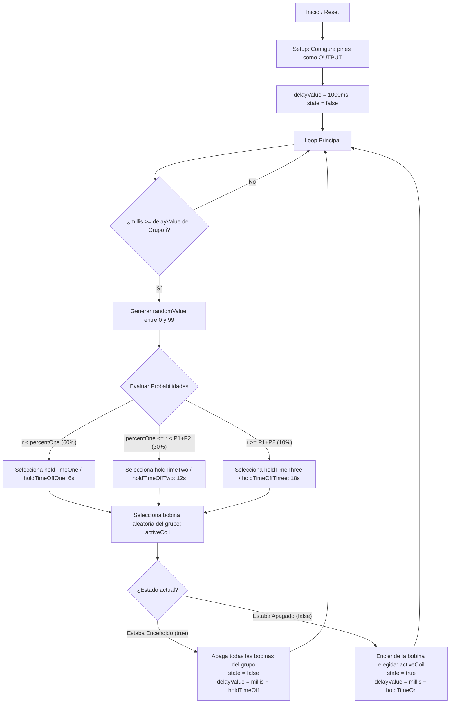

# Secuenciador de Péndulos por Grupos (DFE)

**Autor Original:** Sebastian Gonzalez Dixon (09/2019)  
**Proyecto:** Delirious Fields — Alba Triana Studio  
**Archivo principal:** `Pendulum_Groups_Sequencer_Setian_01.ino`

---

## 1. Descripción General

Este firmware para Arduino implementa un **secuenciador y controlador de bobinas electromagnéticas organizadas por grupos independientes**.

El objetivo del sistema es activar péndulos mediante pulsos magnéticos pseudoaleatorios. Para cada grupo de bobinas:
* Solo **1 bobina** del grupo puede estar encendida a la vez.
* La duración de los estados de **Encendido (ON)** y **Apagado (OFF)** se determina mediante una distribución de probabilidad de 3 niveles.
* La bobina a encender dentro de cada grupo se elige aleatoriamente en cada ciclo de activación.

---

## 2. Hardware Requerido y Compatibilidad

* **Placa recomendada:** **Arduino Mega 2560** (o compatible con al menos 50 pines I/O digitales).
* **Etapa de potencia:** Drivers / Módulos MOSFET o transistores para conmutar las bobinas (el Arduino solo envía señal lógica de 5V, no alimenta las bobinas directamente).
* **Protección:** Diodos de rueda libre (*flyback diodes*, ej. 1N4007 o Schottky) en paralelo con cada bobina para absorber los picos inductivos.

---

## 3. Mapeo y Conexión de Pines Físicos

El código define un arreglo de hasta **50 pines digitales disponibles**:

```cpp
const int hallSensPin[50] = {
   2,  3,  4,  5,  6,  7,  8,  9, 10, 11,
  12, 13, 14, 15, 16, 17, 18, 19, 20, 21,
  22, 23, 24, 25, 26, 27, 28, 29, 30, 31,
  32, 33, 34, 35, 36, 37, 38, 39, 40, 41,
  42, 43, 44, 45, 46, 47, 48, 49, 50, 51
};
```

### Fórmula de Asignación por Grupo

El sistema organiza los pines de forma secuencial según las variables:
* `coilsPerGroup` (Número de bobinas por grupo)
* `numberOfGroups` (Número total de grupos)
* Total de salidas utilizadas: `outputNumber = coilsPerGroup * numberOfGroups` (debe ser $\le 50$)

El pin físico para la bobina `j` del grupo `i` se obtiene con:
$$\text{Pin} = \text{hallSensPin}[i \times \text{coilsPerGroup} + j]$$

---

### Ejemplo 1: Configuración por Defecto (`coilsPerGroup = 1`, `numberOfGroups = 10`)

| Grupo | Bobina | Índice en `hallSensPin` | Pin Físico Arduino Mega |
| :--- | :--- | :---: | :---: |
| **Grupo 0** | Bobina 0 | `[0]` | **Pin 2** |
| **Grupo 1** | Bobina 0 | `[1]` | **Pin 3** |
| **Grupo 2** | Bobina 0 | `[2]` | **Pin 4** |
| **Grupo 3** | Bobina 0 | `[3]` | **Pin 5** |
| **Grupo 4** | Bobina 0 | `[4]` | **Pin 6** |
| **Grupo 5** | Bobina 0 | `[5]` | **Pin 7** |
| **Grupo 6** | Bobina 0 | `[6]` | **Pin 8** |
| **Grupo 7** | Bobina 0 | `[7]` | **Pin 9** |
| **Grupo 8** | Bobina 0 | `[8]` | **Pin 10** |
| **Grupo 9** | Bobina 0 | `[9]` | **Pin 11** |

---

### Ejemplo 2: Si se configuran 2 bobinas por grupo (`coilsPerGroup = 2`, `numberOfGroups = 4`)

| Grupo | Bobina | Pin Físico Arduino Mega |
| :--- | :--- | :---: |
| **Grupo 0** | Bobina 0 / Bobina 1 | **Pin 2 / Pin 3** |
| **Grupo 1** | Bobina 0 / Bobina 1 | **Pin 4 / Pin 5** |
| **Grupo 2** | Bobina 0 / Bobina 1 | **Pin 6 / Pin 7** |
| **Grupo 3** | Bobina 0 / Bobina 1 | **Pin 8 / Pin 9** |

---

## 4. Esquema de Conexión Eléctrica Típica

```
 Arduino Mega                      Etapa de Potencia                     Bobina / Carga
+-------------+                    +-----------------+                 +----------------+
|             |                    |                 |                 |                |
|      Pin 2  |----[ Resistencia ]-| Gate   MOSFET   |                 |   +---------+  |
|             |        220Ω        |                 |                 |   | Bobina  |  |
|             |                    | Drain ----------+-----------------|---|    L1   |  |
|             |                    |                 |  +-[ Diodo ]-+  |   +---------+  |
|             |                    | Source          |  |  Flyback  |  |        |       |
|             |                    +--------+--------+  +-----------+  |        |       |
|             |                             |                          |        |       |
|        GND  |-----------------------------+--------------------------+        |       |
+-------------+                             |                                   |       |
                                           GND                        Fuente DC (+12V a +18V)
```

> ⚠️ **Importante:** La masa (GND) del Arduino debe estar unida a la masa (GND) de la fuente de alimentación de las bobinas para tener una referencia común.

---

## 5. Funcionamiento del Algoritmo



### Detalle de las Probabilidades y Tiempos

Cada grupo tiene asignados arreglos de configuración con valores independientes por posición (hasta 50 elementos):

1. **Probabilidades:**
   * `percentOne[i]` (Por defecto: **60%**) $\rightarrow$ Probabilidad de aplicar el Tiempo 1.
   * `percentTwo[i]` (Por defecto: **30%**) $\rightarrow$ Probabilidad de aplicar el Tiempo 2.
   * **Tercera probabilidad** (Calculada: $100 - (60 + 30) =$ **10%**) $\rightarrow$ Probabilidad de aplicar el Tiempo 3.

2. **Tiempos de Encendido (`holdTime` en segundos):**
   * `holdTimeOne = 6 s`
   * `holdTimeTwo = 12 s`
   * `holdTimeThree = 18 s`

3. **Tiempos de Apagado (`holdTimeOff` en segundos):**
   * `holdTimeOffOne = 6 s`
   * `holdTimeOffTwo = 12 s`
   * `holdTimeOffThree = 18 s`

---

## 6. Variables Modificables en el Código

| Variable | Tipo | Valor por Defecto | Descripción |
| :--- | :--- | :--- | :--- |
| `coilsPerGroup` | `int` | `1` | Cantidad de bobinas asignadas a cada grupo. |
| `numberOfGroups` | `int` | `10` | Cantidad total de grupos a controlar en paralelo. |
| `percentOne` | `int[50]` | `60` | Probabilidad del primer intervalo de tiempo (%). |
| `percentTwo` | `int[50]` | `30` | Probabilidad del segundo intervalo de tiempo (%). |
| `holdTimeOne` | `int[50]` | `6` | Tiempo ON opción 1 (segundos). |
| `holdTimeTwo` | `int[50]` | `12` | Tiempo ON opción 2 (segundos). |
| `holdTimeThree` | `int[50]` | `18` | Tiempo ON opción 3 (segundos). |
| `holdTimeOffOne` | `int[50]` | `6` | Tiempo OFF opción 1 (segundos). |
| `holdTimeOffTwo` | `int[50]` | `12` | Tiempo OFF opción 2 (segundos). |
| `holdTimeOffThree` | `int[50]` | `18` | Tiempo OFF opción 3 (segundos). |
