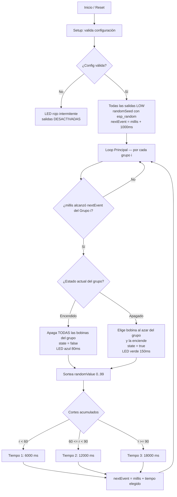

# Secuenciador de Péndulos por Grupos (DFE)

**Proyecto:** Delirious Fields — Alba Triana Studio

| Versión | Archivo | Plataforma | Autor | Fecha |
| :--- | :--- | :--- | :--- | :--- |
| **v2.0 (actual)** | `Pendulum_Groups_Sequencer_ESP32_v2.ino` | Adafruit ESP32 Feather V2 | **Carlos Adrián Serna** | 08/2026 |
| v0.1 (legado) | `Pendulum_Groups_Sequencer_Setian_01.ino` | Arduino Mega 2560 | Sebastian Gonzalez Dixon | 09/2019 |

> **Créditos:** la versión v2.0 es una **versión actualizada para ESP32** del archivo de Arduino
> creado por **Sebastian Gonzalez Dixon en 09/2019**, portada por **Carlos Adrián Serna** al
> mismo hardware que utiliza el sistema **DFC** (`delirious-fields-DFC`).
> El algoritmo artístico original —grupos independientes, una sola bobina encendida por grupo
> y duraciones sorteadas con una distribución de 3 niveles— se conserva íntegro.

---

## 1. Descripción General

Este firmware controla **bobinas electromagnéticas organizadas en grupos independientes**
para activar péndulos mediante pulsos magnéticos pseudoaleatorios. Para cada grupo:

* Solo **1 bobina** del grupo puede estar encendida a la vez.
* La duración de los estados de **Encendido (ON)** y **Apagado (OFF)** se sortea con una
  distribución de probabilidad de **3 niveles**.
* La bobina a encender dentro del grupo se **elige al azar** en cada ciclo de activación.
* Cada grupo corre **su propio reloj**: no hay sincronía entre grupos.

> **Diferencia conceptual con el DFC:** el DFC sincroniza varias placas por ESP-NOW y **alterna**
> las bobinas izquierda/derecha de forma determinista. El DFE es **autónomo por placa** y
> **aleatorio**: no hay maestro, no hay esclavos, no hay red. Son dos obras distintas sobre el
> mismo hardware.

---

## 2. Hardware Requerido (v2.0)

Es **exactamente el mismo hardware del DFC**, sin ninguna modificación de cableado.

| Elemento | Especificación |
| :--- | :--- |
| **Placa** | Adafruit ESP32 Feather V2 |
| **Salidas de potencia** | 8 canales (PCB del DFC — ver `delirious-fields-DFC/Hardware/`) |
| **Etapa de potencia** | MOSFET N-canal *logic-level* (IRLZ44N / FQP30N06L / AOI4184) |
| **Gate** | Resistencia serie 220–330 Ω + pulldown 100 kΩ a GND |
| **Protección** | Diodo Schottky de rueda libre (MBR360) + TVS P6KE30A + fusible T2A |
| **Alimentación bobinas** | 15–18 V DC |
| **Bobinas** | ~15 Ω, 1000 vueltas AWG26 (~1.2 A @ 18 V) |
| **Indicador** | LED NeoPixel integrado (pin 0) |

> ⚠️ La masa (GND) del ESP32 debe estar unida a la masa de la fuente de las bobinas.
> El ESP32 entrega **3.3 V** de lógica (no 5 V como el Arduino Mega), por eso los MOSFET
> **deben** ser *logic-level*.

---

## 3. Mapeo de Pines

El código usa un **arreglo plano de 8 salidas**, ordenado `{Izquierda, Derecha}` por péndulo,
para que coincida con el cableado físico del PCB del DFC:

```cpp
#define TOTAL_OUTPUTS 8
const int coilPin[TOTAL_OUTPUTS] = { 22, 20, 14, 32, 15, 33, 27, 12 };
```

El pin físico de la bobina `j` del grupo `i` se obtiene con la **misma fórmula de la versión
original**:

$$\text{Pin} = \text{coilPin}[\,i \times \text{coilsPerGroup} + j\,]$$

### Configuración por defecto (`coilsPerGroup = 2`, `numberOfGroups = 4`)

Cada grupo es **un péndulo** con sus dos bobinas; el firmware enciende una de las dos al azar.

| Grupo (péndulo) | Bobina 0 (Izq) | Bobina 1 (Der) |
| :--- | :---: | :---: |
| **Grupo 0** | Pin 22 | Pin 20 |
| **Grupo 1** | Pin 14 | Pin 32 |
| **Grupo 2** | Pin 15 | Pin 33 |
| **Grupo 3** | Pin 27 | Pin 12 |

### Configuración alternativa (`coilsPerGroup = 1`, `numberOfGroups = 8`)

Cada bobina es **un grupo independiente** que se enciende y apaga con su propio ritmo
(equivalente al `1 × 10` de la versión Arduino, limitado a las 8 salidas del PCB).

| Grupo | Pin | Grupo | Pin |
| :--- | :---: | :--- | :---: |
| Grupo 0 | Pin 22 | Grupo 4 | Pin 15 |
| Grupo 1 | Pin 20 | Grupo 5 | Pin 33 |
| Grupo 2 | Pin 14 | Grupo 6 | Pin 27 |
| Grupo 3 | Pin 32 | Grupo 7 | Pin 12 |

> **Regla:** `coilsPerGroup × numberOfGroups ≤ 8`. Si se supera, el firmware **no energiza
> ninguna salida** y parpadea en rojo (ver §6).

---

## 4. Esquema de Conexión Eléctrica

```
 ESP32 Feather V2                  Etapa de Potencia                     Bobina / Carga
+-----------------+                +-----------------+                 +----------------+
|                 |                |                 |                 |                |
|         GPIO 22 |---[ 220-330Ω ]-| Gate   MOSFET   |                 |   +---------+  |
|          (3.3V) |          |     |  logic-level    |                 |   | Bobina  |  |
|                 |      [100kΩ]   | Drain ----------+-----------------|---|    L1   |  |
|                 |          |     |                 |  +-[Schottky]-+ |   +---------+  |
|                 |         GND    | Source          |  |  Flyback   | |        |       |
|                 |                +--------+--------+  +------------+ |        |       |
|             GND |-------------------------+-------------------------+        |       |
+-----------------+                         |                                  |       |
                                           GND                       Fuente DC (+15V a +18V)
                                                                     + Fusible T2A + TVS + C bulk
```

---

## 5. Funcionamiento del Algoritmo



### Probabilidades y Tiempos (por defecto)

| Nivel | Probabilidad | Tiempo ON | Tiempo OFF |
| :--- | :---: | :---: | :---: |
| 1 | `percentOne` = **60 %** | `holdTimeOne` = **6000 ms** | `holdTimeOffOne` = **6000 ms** |
| 2 | `percentTwo` = **30 %** | `holdTimeTwo` = **12000 ms** | `holdTimeOffTwo` = **12000 ms** |
| 3 | resto = **10 %** | `holdTimeThree` = **18000 ms** | `holdTimeOffThree` = **18000 ms** |

La tercera probabilidad se calcula sola: `100 − (percentOne + percentTwo)`.
Todos los valores son **arreglos por grupo**, así que cada péndulo puede tener su propio carácter.

---

## 6. Indicador LED NeoPixel

| Color | Significado | Duración |
| :--- | :--- | :--- |
| 🟢 **Verde** | Una bobina se acaba de **encender** | 150 ms |
| 🔵 **Azul** | Un grupo se acaba de **apagar** | 80 ms |
| ⚪ **Blanco tenue** | Latido: el sistema está vivo (sin eventos recientes) | 40 ms cada 10 s |
| 🔴 **Rojo intermitente** | **Configuración inválida** — las salidas están desactivadas | continuo |

Si ves **rojo continuo**, abre el monitor serie a **115200 baudios**: el firmware imprime
exactamente qué parámetro está mal.

---

## 7. Monitor Serie (115200 baudios)

```
==============================================
DFE - Secuenciador de Pendulos por Grupos v2.0
ESP32 Feather V2 | Delirious Fields
Original: Sebastian Gonzalez Dixon (09/2019)
Port ESP32: Carlos Adrian Serna (08/2026)
==============================================
[OK] Grupos: 4 | Bobinas por grupo: 2 | Salidas usadas: 8/8
     Grupo 0 -> pines: 22, 20  | probabilidades: 60% / 30% / 10%
     Grupo 1 -> pines: 14, 32  | probabilidades: 60% / 30% / 10%
     ...
[!] Grupo 0: tiempo ON maximo de 18000 ms supera los 7000 ms de diseno termico del PCB.
[>] Secuenciador en marcha.
[*] ON  - Grupo 0 | Bobina 1 (pin 20) | TON: 6000 ms
[ ] OFF - Grupo 0 | TOFF: 12000 ms
```

| Prefijo | Significado |
| :--- | :--- |
| `[*]` | Bobina encendida |
| `[ ]` | Grupo apagado |
| `[OK]` | Configuración validada |
| `[i]` | Información |
| `[!]` | Advertencia (no detiene la operación) |
| `[X]` | Error de configuración (detiene las salidas) |

---

## 8. Variables Modificables

Todo está en la sección **`CONFIGURATION SECTION`** al inicio del sketch.

| Variable | Tipo | Por Defecto | Descripción |
| :--- | :--- | :--- | :--- |
| `coilsPerGroup` | `const int` | `2` | Bobinas por grupo (solo 1 encendida a la vez). |
| `numberOfGroups` | `const int` | `4` | Grupos independientes en paralelo. |
| `coilPin[8]` | `const int[]` | `{22,20,14,32,15,33,27,12}` | Mapa plano de salidas físicas. |
| `percentOne[8]` | `int[]` | `60` | Probabilidad del nivel 1 (%). |
| `percentTwo[8]` | `int[]` | `30` | Probabilidad del nivel 2 (%). |
| `holdTimeOne/Two/Three[8]` | `unsigned long[]` | `6000 / 12000 / 18000` | Tiempos **ON** en **ms**. |
| `holdTimeOffOne/Two/Three[8]` | `unsigned long[]` | `6000 / 12000 / 18000` | Tiempos **OFF** en **ms**. |
| `STARTUP_DEAD_TIME` | `const unsigned long` | `1000` | Tiempo muerto al encender (ms). |
| `SAFETY_MAX_ON_MS` | `const unsigned long` | `0` | Recorte térmico de los tiempos ON (`0` = desactivado). |
| `HW_RECOMMENDED_MAX_ON` | `const unsigned long` | `7000` | Umbral que dispara la advertencia térmica. |
| `NEOPIXEL_PIN` | `#define` | `0` | Pin del LED NeoPixel. |

---

## 9. ⚠️ Nota térmica importante

La bobina disipa ~**21 W** mientras está encendida (~15 Ω a 18 V ≈ 1.2 A, ver
`delirious-fields-DFC/Hardware/Readme.md`). Lo que calienta no es solo cuánto dura cada
encendido, sino **cuánta fracción del tiempo la bobina está encendida**. Son dos riesgos distintos:

* **Potencia media** (duty cycle) → fija la temperatura de equilibrio de la bobina.
* **Pico continuo** (encendido más largo sin pausa) → fija cuánto se sale por encima de esa
  temperatura en cada golpe.

| Firmware | Duty por bobina | Potencia media | Pico continuo |
| :--- | ---: | ---: | ---: |
| DFC (referencia) | 37 % | **7.8 W** | 7.97 s |
| **DFE 2×4 (config. por defecto)** | 25 % | **5.2 W** | **18.0 s** |
| DFE 1×8 | 50 % | **10.5 W** | **18.0 s** |

### Qué significa en la práctica

* **DFE en `2 × 4` (por defecto): más suave que el DFC en promedio.** Con 2 bobinas por grupo
  elegidas al azar, cada bobina trabaja solo el 25 % del tiempo — menos carga térmica sostenida
  que el DFC, que vive encendido el 75 % del tiempo por grupo. El punto a vigilar aquí es el
  **pico**: 18 s seguidos sin pausa, más del doble que los ~8 s del DFC.

* **DFE en `1 × 8`: es la configuración a vigilar.** Cada bobina es su propio grupo, así que el
  duty sube al 50 % (**10.5 W medios, más que el DFC**) *y además* conserva los picos de 18 s.
  Acumula los dos riesgos a la vez. Si vas a usar `1 × 8`, activa el recorte o alarga los
  tiempos OFF.

> **Nota sobre el documento de hardware:** el PCB se dimensionó bajo el escenario de
> "activaciones ocasionales de hasta ~7 s". El DFC real opera muy por encima de eso en duty
> cycle (75 %), así que ese margen ya venía ajustado antes del DFE. Los componentes de
> conmutación no son el problema (el MOSFET disipa ~0.03 W); el elemento térmicamente crítico
> es **la bobina misma**.

### Qué se hizo al respecto

Los tiempos por defecto (6/12/18 s) **no se cambiaron**, para no alterar el comportamiento
artístico original. En su lugar:

* El firmware **imprime una advertencia** al arrancar indicando qué grupos superan el umbral.
* Recorte opcional: `SAFETY_MAX_ON_MS = 7000` limita cualquier tiempo ON a 7 s.
* Alternativa sin tocar el pico: **alargar los tiempos OFF** (`holdTimeOff*`) reduce el duty
  cycle sin cambiar la duración del gesto.
* En cualquier caso, **medir la temperatura de las bobinas** en una sesión larga antes de dejar
  la pieza sin supervisión — sobre todo en `1 × 8`.

---

## 10. Instalación y Uso

### Requisitos

* Arduino IDE (o `arduino-cli`) con el **core ESP32** instalado.
* Librería **Adafruit NeoPixel**.
* Placa: **Adafruit Feather ESP32 V2** (`esp32:esp32:adafruit_feather_esp32_v2`).

### Pasos

1. Colocar `Pendulum_Groups_Sequencer_ESP32_v2.ino` en una carpeta con **el mismo nombre**
   que el archivo (requisito del IDE de Arduino).
2. Ajustar `coilsPerGroup` y `numberOfGroups` según el montaje.
3. Seleccionar la placa **Adafruit Feather ESP32 V2** y cargar.
4. Abrir el monitor serie a **115200** y verificar el mapa de pines impreso en el arranque.
5. Conectar la alimentación de bobinas (15–18 V) **con la GND en común**.

### Compilación por línea de comandos

```bash
arduino-cli lib install "Adafruit NeoPixel"
arduino-cli compile --fqbn esp32:esp32:adafruit_feather_esp32_v2 Pendulum_Groups_Sequencer_ESP32_v2
```

> Verificado: compila sin advertencias en el core `esp32:esp32` 3.3.7
> (≈ 9 % de flash, ≈ 7 % de RAM), tanto en la configuración `2 × 4` como en la `1 × 8`.

---

## 11. Notas de la actualización (v0.1 Arduino → v2.0 ESP32)

### 11.1 Cambio de plataforma

| | Arduino v0.1 | ESP32 v2.0 |
| :--- | :--- | :--- |
| Placa | Arduino Mega 2560 | Adafruit ESP32 Feather V2 |
| Lógica | 5 V | **3.3 V** (requiere MOSFET *logic-level*) |
| Salidas declaradas | 50 pines (2–51) | **8 pines** del PCB del DFC |
| Velocidad de reloj | 16 MHz | 240 MHz |
| Diagnóstico | Ninguno | LED NeoPixel + traza serie 115200 |

### 11.2 Correcciones de comportamiento

1. **Probabilidades sin valores muertos.**
   La versión Arduino comparaba con `>` estricto:
   ```cpp
   if (randomValue < percentOne[i]) { ... }
   else if (randomValue > percentOne[i] && randomValue < (percentOne[i]+percentTwo[i])) { ... }
   else if (randomValue > (percentOne[i]+percentTwo[i])) { ... }
   ```
   Con los valores por defecto, `randomValue == 60` y `randomValue == 90` **no entraban en
   ninguna rama**: el grupo cambiaba de estado pero `delayValue` se quedaba igual, así que en
   el siguiente ciclo del `loop()` volvía a conmutar de inmediato. En la práctica eso producía
   un **parpadeo rapidísimo de la bobina** aproximadamente 2 de cada 100 activaciones.
   La v2.0 usa **cortes acumulados** (`r < p1`, `r < p1+p2`, resto), de modo que los 100 valores
   posibles siempre caen en exactamente un nivel.

2. **Temporizado real, sin `delay()` bloqueante.**
   La versión Arduino hacía `delay(5)` después de cada `digitalWrite()`, **dentro** del recorrido
   de grupos. Con 10 grupos eso podía congelar el `loop()` decenas de milisegundos y retrasar a
   los demás grupos. La v2.0 **no bloquea nunca**: el LED también es no bloqueante.

3. **Inmunidad al desbordamiento de `millis()`.**
   La comparación original `millis() >= delayValue[i]` se rompe a los ~49 días de operación
   continua (los grupos podían quedarse congelados). La v2.0 usa `(long)(now - nextEvent[i]) >= 0`,
   que es correcto a través del desbordamiento — importante para una instalación que queda
   encendida por semanas.

4. **Aleatoriedad real en cada arranque.**
   La versión Arduino nunca llamaba a `randomSeed()`, así que **repetía exactamente la misma
   secuencia** en cada encendido. La v2.0 siembra con `esp_random()` (generador de hardware):
   cada arranque de la pieza es distinto.

5. **Arranque seguro.**
   La v2.0 pone todas las salidas en `LOW` **antes** de cualquier otra inicialización y valida la
   configuración antes de energizar nada. Si `coilsPerGroup × numberOfGroups > 8`, la versión
   Arduino habría escrito sobre pines fuera del arreglo; la v2.0 se detiene y avisa en rojo.

### 11.3 Diferencias prácticas de funcionamiento

Esto es lo que se **nota** al operar la pieza:

| Aspecto | Arduino v0.1 | ESP32 v2.0 |
| :--- | :--- | :--- |
| **Unidad de tiempo** | Segundos enteros (`6`, `12`, `18`) | **Milisegundos** (`6000`, `12000`, `18000`) — permite tiempos finos tipo `5770 ms` como en el DFC |
| **Ritmo** | Se cuela un parpadeo espurio ~2 % de las veces | Ritmo limpio, sin conmutaciones instantáneas |
| **Precisión entre grupos** | Los grupos se estorban por los `delay()` | Cada grupo mantiene su tiempo con precisión de ms |
| **Repetibilidad** | Idéntica en cada encendido | Distinta en cada encendido |
| **Diagnóstico** | A ciegas | LED de color + log serie de cada evento |
| **Config inválida** | Comportamiento indefinido | Se bloquea y avisa en rojo |
| **Operación prolongada** | Se cuelga a los ~49 días | Estable indefinidamente |
| **Capacidad** | Hasta 50 salidas (Mega) | 8 salidas (limitado por el PCB del DFC, no por el ESP32) |
| **Agrupación por defecto** | 10 grupos × 1 bobina | 4 grupos × 2 bobinas (Izq/Der del péndulo) |

### 11.4 Lo que **no** cambió

* El algoritmo artístico: una bobina por grupo, elegida al azar, con 3 niveles de duración.
* La fórmula de asignación de pines `grupo × coilsPerGroup + bobina`.
* Los valores por defecto de probabilidades (60/30/10) y de tiempos (6/12/18 s).
* La estructura de configuración por arreglos, un valor por grupo.
* El tiempo muerto de 1000 ms al arrancar.

---

## 12. Archivo legado

`Pendulum_Groups_Sequencer_Setian_01.ino` se conserva **como referencia histórica** del código
original de Sebastian Gonzalez Dixon (09/2019) para Arduino Mega 2560. **No es compatible con el
PCB del DFC** (usa pines 2–51 que no existen en el Feather V2 y lógica de 5 V). Para cualquier
montaje nuevo sobre este hardware, usar la v2.0.
